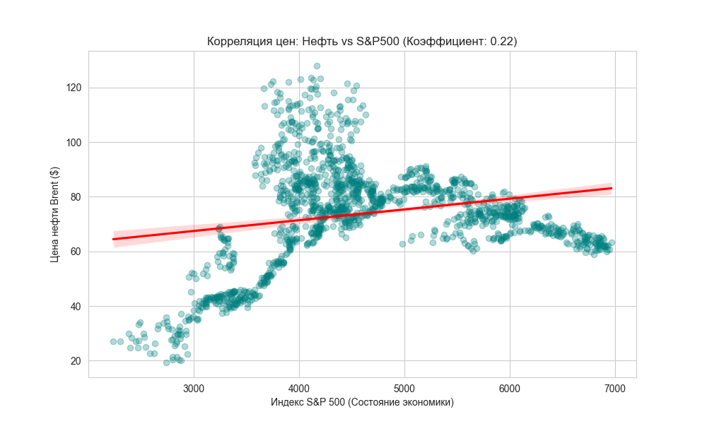

# 🛢️ Анализ рынка нефти и экономических индексов

Проект автоматизированного мониторинга цен на нефть Brent и их взаимосвязи с мировым фондовым рынком.

## 📈 1. Анализ трендов (Brent Oil)
Ниже представлена динамика цен с наложением скользящих средних. Это помогает отфильтровать рыночный шум и увидеть реальное направление движения цены.

## 📊 2. Связь с экономикой (Oil vs S&P 500)
Анализ корреляции показывает, насколько сильно стоимость энергоносителей зависит от общего состояния фондового рынка США.

## 🛠️ Стек технологий
* **Python 3.13**: Использование `Pandas` для обработки данных
* **Библиотеки**: `yfinance` для сбора, `Seaborn` и `Matplotlib` для визуализации
* **Статистика**: Расчет коэффициента корреляции Пирсона

## 🚀 Инструкция
1. Собрать данные: `python src/download_data.py`
2. Провести анализ: `python src/analysis.py`
