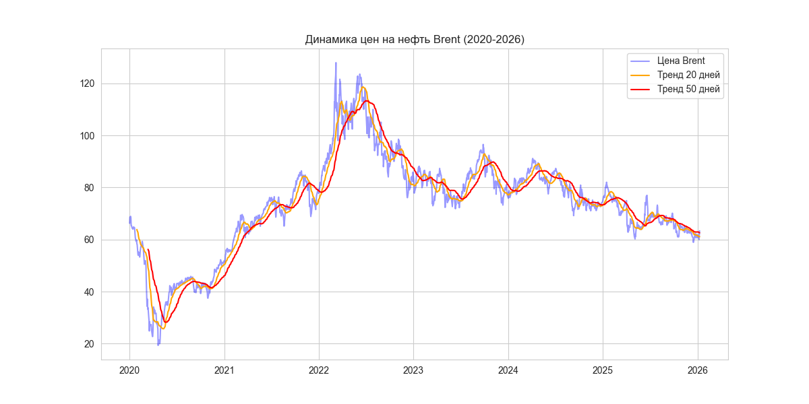

# 🛢️ Oil Price Analysis & Forecasting

Проект по автоматизированному сбору и анализу цен на нефть марки Brent. Разработан в рамках обучения на аналитика данных.

## 📊 Результаты анализа
Ниже представлен график динамики цен с наложением скользящих средних (MA20 и MA50), что позволяет определять краткосрочные и долгосрочные тренды.

## 🛠️ Технологический стек
* **Python 3.13** (использование современных библиотек)
* **Pandas**: Обработка временных рядов и расчет метрик.
* **yfinance**: Автоматизированный сбор данных с Yahoo Finance.
* **Matplotlib & Seaborn**: Профессиональная визуализация данных.
* **Scikit-learn**: Линейная регрессия для базового прогнозирования.

## 🚀 Как запустить проект
1. Установите зависимости: `pip install -r requirements.txt`
2. Соберите свежие данные: `python src/download_data.py`
3. Запустите анализ и обновите графики: `python src/analysis.py`

## 🗺️ Roadmap
- [x] Автоматизация сбора данных (API).
- [x] Визуализация трендов и волатильности.
- [ ] Добавление статистического анализа (корреляция с S&P500).
- [ ] Интеграция с Airflow для ежедневного обновления (планируется в апреле).
